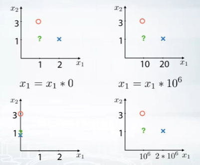
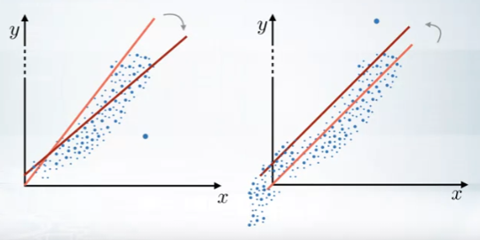
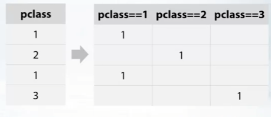
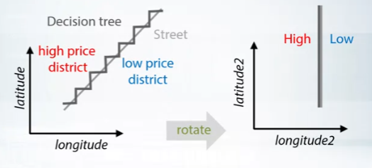

- Feature preprocessing
- Feature generation
- Dependence on a model Type

## Numeric Features

### Feature preprocessing

#### Scaling



The scaling of features could affect the interpretation a model make. (Larger scale tends to have a weighted influences)

We use preprocessing to ==scale all features to one scale==, so that their initial impact on the model will be roughly similar. For example, as in the recent example where we used KNN for prediction, this could lead to the case where some features will have critical influence on predictions.

Handling different scales:

1. To `[0,1]`

   `sklearn.preprocessing.MinMaxScaler` $X=(X-X.min())/(X.max()-X.min())$

2. To `mean = 0` `std = 1`

   `sklearn.preprocessing.StandardScaler` $X=(X-X.mean())/X.std()$

#### Outliers



Small proportional of outlying data could have great impact on the model predication.

To eliminate this negative effect, a certain range of data should be chosen. (common in Financial data)

winsorization (choose between 1%~99%)

#### Rank

Ranking is another way to handle outliers. e.g. `rank([1000,1,10]) = [2,0,1]` `scipy.stats.rankdata`

#### Transformation

`np.log(1+x)` and `np.sqrt(x+2/3)`

### Feature generation

Goal: Generate features for interpreting

Ways to proceed: prior knowledge / EDA (Explorative data analysis)

Cases:

- Distance: combine horizontal and vertical distance
- Price: extract the fractional_part


### Conclusion

1. Numeric feature preprocessing is different for tree and non-tree models
   - Tree-based models doesn’t depend on them
   - Non-tree-based models hugely depend on them
2. Most often used preprocessings are:
   - `MinMaxScaler `- to `[0,1]` - $X=(X-X.min())/(X.max()-X.min())$
   - `StandardScaler` - to mean = 0, std = 1
   - Rank - sets spaces between sorted values to be equal
   - `np.log(1+x)` and `np.sqrt(1+x)`
3. Features generation is powered by:
   - Prior knowledge
   - Exploratory data analysis 

## Categorical and ordinal features

### Feature Preprocessing

#### Definitions

- Different from numeric features. The difference between different categories could not be deduced by its difference numerically. 
- Tree-methods can split feature, and extract most of the useful values in categories on its on.
- Non-tree-based-models, can’t use this feature effectively. If a linear model kNN on neural network, the categorical feature should be treated differently.
- Examples:
  - Ticket class: 1,2,3
  - Driver’s license
  - Education: kindergarden, school, undergraduate, bachelor, master, doctoral

#### Label Encoding

Mostly for ==tree based models==. This method maps categories to numbers

1. Alphabetical (sorted) `[S,C,Q] -> [2,1,3]` `sklearn.preprocessing.LabelEncoder`
2. Order of appearance `[S,C,Q] -> [1,2,3]` `Pandas.factorize`

#### Frequency encoding

Often used in ==tree-based models==. This method maps categories to their frequencies.

1. Frequency encoding `[S,C,Q] -> [0.5, 0.3, 0.2]` (helpful for both linear and tree models)

   ```python
   encoding = titanic.groupby('Embarked').size()
   encoding = encoding/len(titanic)
   titanic['enc'] = titanic.Embarked.map(encoding)
   ```

#### One-hot encoding

- An encoding method for ==non-tree-based models==. Split the current categorical feature based on its value into different binary columns.



```python
pandas.get_dummies
sklearn.preprocessing.OneHotEncoder
```

- Limitations:
  - Hard for tree-methods to interpret the data.
  - Could result in memory waste (storing a lot of 0 values) -> use `sparse matrix`

### Feature generation

- Interactions of categorical features can help linear models and KNN.

  

## Datetime and coordinates

### Data and time

1. Periodicity

   Day number in week, month, season, year, second, minute, hour.

2. Time since

   - Row-independent moment (e.g. since 00:00:00 UTC, 1 January 1970)
   - Row-dependent important moment (Number of days left until next holidays / time passed after last holiday)

3. Difference between dates

### Coordinates

1. Interesting places from train/test data or additional data
2. Centers of clusters
3. Aggregated statistics



## Handling missing values

Missing values could be hidden. (Replaced by other number or placeholder)

Fillna approaches:

1. Use specific value: -999,-1,etc 

   Pros: take missing value to separate category

   Cons: performance of linear networks can suffer

2. Mean, median

   Pros: beneficial for simple linear models and neural networks.

3. Reconstruct value


### Feature generation

1. Adding new feature `isnull` indicating which rows have missing values

   Pros: Solve the problems when trees and neural networks computing mean or median.

   Cons: Double the number of columns in data set.

### Summary

1. The choice of method to fill `NaN` depends on the situation
2. Usual way to deal with missing values is to replace them with `-999`, mean or median
3. Missing values already can be replaced with something by organizers 
4. Binary feature `isnull` can be beneficial
5. In general, avoid filling nans before feature generation
6. Xgboost can handle NaN


## Additional Material and Links

### Feature preprocessing

- [Preprocessing in Sklearn](http://scikit-learn.org/stable/modules/preprocessing.html)
- [Andrew NG about gradient descent and feature scaling](https://www.coursera.org/learn/machine-learning/lecture/xx3Da/gradient-descent-in-practice-i-feature-scaling)
- [Feature Scaling and the effect of standardization for machine learning algorithms](http://sebastianraschka.com/Articles/2014_about_feature_scaling.html)


### Feature generation

- [Discover Feature Engineering, How to Engineer Features and How to Get Good at It](https://machinelearningmastery.com/discover-feature-engineering-how-to-engineer-features-and-how-to-get-good-at-it/)
- [Discussion of feature engineering on Quora](https://www.quora.com/What-are-some-best-practices-in-Feature-Engineering)