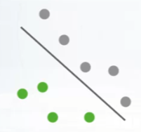
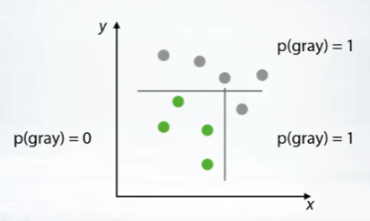

# Week 1 - Introduction & Recap

## Course Overview

### Goals

Getting the required knowledge and expertise to successfully participate in data science competitions

- Week 1
  - Intro to competitions & Recap
  - Feature preprocessing & extraction
- Week 2
  - EDA
  - Validation
  - Data leaks
- Week 3
  - Metrics
  - Mean-encodings
- Week 4
  - Advanced features
  - Hyperparameter optimization
  - Ensembles
- Week 5
  - Final project
  - Winning solutions

### Assignments

- Competition
  - Week2: basic pipeline
    - EDA
    - Validation
    - Data leaks
  - Week3: improve model
    - Metrics
    - Mean-encodings
  - Week4: Improve model
    - Advanced features
    - Hyperparameter optimization
    - Ensembles
- Quizzes
- Programming assignments

### Schedule

## Competition mechanics

### Concepts

- Data - Provided by competition holder, the format can be varied.
- Model - Used to train your data. Something transform data into answers.
- Submission - Your prediction on certain test sets. (To avoid intentional submission for test results, a private test set would be used for final score after competition closes)
- Evaluation - How your predictions are evaluated. (e.g. Accuracy, Logistic loss, AUC, RMSE, MAE)
- Leaderboard (See how others are performing)

### Basic Procedure

1. Get the data set
2. Analyze the the data
3. Submit your predication
4. Check leaderboards
5. Improve your solution
6. End of competition

### Platform

- Kaggle
- DrivenData
- CrowdAnalityx
- CodeLab
- DataScienceChallenge.net
- Datascience.net
- Single-competition sites(like KDD, VizDooM)

### Real World Application vs. Competitions

#### Real World ML Pipeline

- Understanding of business problem
- Problem formalization
- data collecting
- Data preprocessing
- Modelling
- Way to evaluate model in real life
- Deploy the model
- Test & further improvements

| Aspect                  | Real Life | Competition |
| ----------------------- | --------- | ----------- |
| Problem formalization   | Y         | N           |
| Choice of target metric | Y         | N           |
| Deployment issues       | Y         | N           |
| Inference speed         | Y         | N           |
| Data collecting         | Y         | N/Y         |
| Model complexity        | Y         | N/Y         |
| Target metric value     | Y         | Y           |

#### Philosophy

- It’s not only about algorithms
  - It is all about data and making things work.
- Do not limit yourself
  - You can use
    - Heuristics
    - Manual data analysis
  - Do not be afraid of 
    - Complex solutions
    - Advanced feature engineering
    - Doing huge calculation
- Be creative - Feel free to modify the source code.
- Enjoy

## Recap of main ML algorithms

### Families of ML algorithms

#### Linear

- Linear models split space into 2 subspaces.

A line separating different class of objects (Or a plane in 3d dimension)

Examples: Logistic Regression / Support Vector Machines

Limitations: Too simple, could not generalize well for certain situation.

Support: Scikit-Learn & vowpal wabbit

#### Tree-based

- Tree-based method splits space into boxes

Using multiple lines parallel to axes to classify inputs. (Divide & conquer)

Example: Random forest / Gradient Boosted Decision Trees (separated by different split methods)

Limitation:  Hard to capture linear dependencies.

Support: Scikit-Learn(gradient boost decision trees), XGBoost & LightGBM

#### kNN-based methods

- k-NN methods heavy rely on how to measure points "closeness"

Assumption: Close objects are more likely to have same label.

Limitations: Unable to process images.

Support: Scikit-learn

#### Neural Networks

- Feed-forward NNs produce smooth non-linear decision boundary.

Provide a smooth separating curve in contrast to decision trees.

TensorFlow playground

Support: TensorFlow, MXNet, PyTorch, Lasagne

### No free Lunch Theorem

> "Here is no method which outperforms all others for all tasks"
>
> "For every method we can construct a task for which this particular method will not be the best"

### Overview of methods

- [Explanation of Random Forest](http://www.datasciencecentral.com/profiles/blogs/random-forests-explained-intuitively)

- [Explanation/Demonstration of Gradient Boosting](http://arogozhnikov.github.io/2016/06/24/gradient_boosting_explained.html)

- [Example of kNN](https://www.analyticsvidhya.com/blog/2014/10/introduction-k-neighbours-algorithm-clustering/)

  

- [Scikit-Learn (or sklearn) library](http://scikit-learn.org/)
- [Overview of k-NN](http://scikit-learn.org/stable/modules/neighbors.html) (sklearn's documentation)
- [Overview of Linear Models](http://scikit-learn.org/stable/modules/linear_model.html) (sklearn's documentation)
- [Overview of Decision Trees](http://scikit-learn.org/stable/modules/tree.html) (sklearn's documentation)
- Overview of algorithms and parameters in [H2O documentation](http://docs.h2o.ai/h2o/latest-stable/h2o-docs/data-science.html)

  

### Additional Tools

- [Vowpal Wabbit](https://github.com/JohnLangford/vowpal_wabbit) repository
- [XGBoost](https://github.com/dmlc/xgboost) repository
- [LightGBM](https://github.com/Microsoft/LightGBM) repository
- [Interactive demo](http://playground.tensorflow.org/) of simple feed-forward Neural Net
- Frameworks for Neural Nets: [Keras](https://keras.io/)[,](https://keras.io%2C/)[PyTorch](http://pytorch.org/)[,](http://pytorch.org%2C/)[TensorFlow](https://www.tensorflow.org/)[,](https://www.tensorflow.org%2C/)[MXNet](http://mxnet.io/), [Lasagne](http://lasagne.readthedocs.io/)
- [Example from sklearn with different decision surfaces](http://scikit-learn.org/stable/auto_examples/classification/plot_classifier_comparison.html)
- [Arbitrary order factorization machines](https://github.com/geffy/tffm)

## Software/Hardware Requirements

- Most of competitions (expect image-based) can be solved on:
  - High-level laptop
  - 16+gb ram
  - 4+ cores
- Good setup
  - Tower PC
  - 32+ gb ram
  - 6+cores

### Cloud resources

- Amazon AWS (spot option)
- Microsoft Azure
- Google cloud

### Software: language

Most of competitors use Python.

- Basic stack
  - `NumPY`
  - `pandas`
  - `sickit-learn`
  - `matplotlib`

- IDE

  `IPython `+ `Jupyter`

- Special packages

  `XGBoost `/ `LightGBM `for gradient-boosted decision trees

  `Keras `for neural nets 

  `vowpal wabbit` for large datasets

  `libfm` & `libffm` optimization machines, used for sparse data(like click-through prediction).

### StandCloud Computing:

- [AWS](https://aws.amazon.com/), [Google Cloud](https://cloud.google.com/), [Microsoft Azure](https://azure.microsoft.com/)

### AWS spot option:

- [Overview of Spot mechanism](http://docs.aws.amazon.com/AWSEC2/latest/UserGuide/using-spot-instances.html)
- [Spot Setup Guide](http://www.datasciencebowl.com/aws_guide/)

### Stack and packages:

- [Basic SciPy stack (ipython, numpy, pandas, matplotlib)](https://www.scipy.org/)
- [Jupyter Notebook](http://jupyter.org/)
- [Stand-alone python tSNE package](https://github.com/danielfrg/tsne)
- Libraries to work with sparse CTR-like data: [LibFM](http://www.libfm.org/), [LibFFM](https://www.csie.ntu.edu.tw/~cjlin/libffm/)
- Another tree-based method: RGF ([implemetation](https://github.com/baidu/fast_rgf), [paper](https://arxiv.org/pdf/1109.0887.pdf))
- Python distribution with all-included packages: [Anaconda](https://www.continuum.io/what-is-anaconda)
- [Blog "datas-frame" (contains posts about effective Pandas usage)](https://tomaugspurger.github.io/)