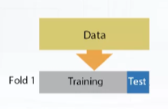
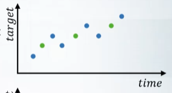
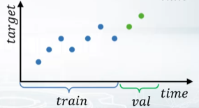

# Validation

### Learning Goals

1. Understand the concept of validation and overfitting
2. Identify the number of splits that should be done to establish stable validation (2nd video)
3. Break down most frequent ways to repeat train test split (3rd video)
4. Discuss most often validation problems & How to tackle them (4th video)

## Validation & overfitting

> - underfitting:
>
> - overfitting:

1. Validation helps us evaluate a quality of the model
2. Validation helps us select the model which will perform best on the unseen data
3. Underfitting refers to not capturing enough patterns in the data
4. Generally, overfitting refers to
   1. Capturing noize
   2. Capturing patterns which do not generalize to test data
5. In competitions, overfitting refers to
   1. low model’s quality on test data,which was unexpected due to validation scores.

## Validation strategies

The main rule you should know — *never use data you train on to measure the quality of your model*. The trick is to split all your data into *training* and *validation* parts. 

Below you will find several ways to validate a model.

### Validation types

- Holdout

  1. Split train data into two parts: partA and partB.
  2. Fit the model on partA, predict for partB.
  3. Use predictions for partB for estimating model quality. Find such hyper-parameters, that quality on partB is maximized.

  

  `sklearn.model_selection.ShuffleSplit`

- K-fold

  1. Split train data into K folds. 
  2. Iterate though each fold: retrain the model on all folds except current fold, predict for the current fold.
  3. Use the predictions to calculate quality on each fold. Find such hyper-parameters, that quality on each fold is maximized. You can also estimate mean and variance of the loss. This is very helpful in order to understand significance of improvement.

  repeated holdout. Use every sample for validation for one time.

  

  `sklearn.model_selection.Kfold`

- Leave-one-out: `ngroups = len(train)`

  1. Iterate over samples: retrain the model on all samples except current sample, predict for the current sample. You will need to retrain the model N times (if N is the number of samples in the dataset).
  2. In the end you will get LOO predictions for every sample in the trainset and can calculate loss.  

  `sklearn.model_selection.LeaveOneOut`

Notice, that these are *validation* schemes are supposed to be used to estimate quality of the model. When you found the right hyper-parameters and want to get test predictions don't forget to retrain your model using all training data.

### Stratification

Stratification preserve the same target distribution over different folds.

- Stratification is useful for
  - small datasets
  - Unbalanced datasets
  - Multiclass classification

## Data splitting strategies

==Validation set up should mimic the train test split.==

Logic of feature generation depends on the data splitting strategy.

1. Previous and next target values

   

2. Time-based trend

   

Different splitting strategies can differ significantly:

1. In generated features
2. In a way the model will rely on that features
3. In some kind of target leak

### Strategies

1. Random, rowwise

   - When rows are independent of each other.

2. Timewise

   - Split the train & test data by a specific date

   - E.g. moving window

     

3. By id

   - 

4. Combined

## Problems occurring during validation

### Validation Stage

Causes of different scores and optimal parameters

1. Too little data
2. Too diverse and inconsistent data

We should do extensive validation:

1. Average scores from different KFold splits
2. Tune model on one split, evaluate score on the other

### Submission Stage

We can observe that:

- LB score is consistently higher/lower than validation score
- LB score is not correlated with validation score at all

Causes for problems:

1. We may already have quite different scores in Kfold

2. too little data in public leaderboard

3. incorrect train/test split

4. train and test data are from different distributions

   Leaderboard probing.

#### Expect LB shuffle because of

- Randomness
- Little amount of data
- Different public/private distributions

### Conclusion

- If we have big dispersion of scores on validation stage, we should do extensive validation
  - Average scores from different KFold splits
  - Tune Model on one split, evaluate score on the other
- If submission’s score do not match local validation score, we should
  - Check if we have too little data in public LB
  - Check if we overfitted
  - Check if we chose correct splitting strategy
  - Check if train/test have different distributions

# Additional material and links

------

- [Validation in Sklearn](http://scikit-learn.org/stable/modules/cross_validation.html)
- [Advices on validation in a competition](http://www.chioka.in/how-to-select-your-final-models-in-a-kaggle-competitio/)